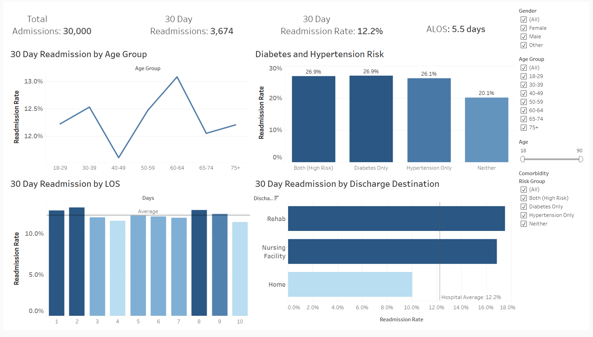

# Hospital Readmission Risk Analysis

# Project Overview
Interactive Tableau dashboard performing Exploratory Data Analysis (EDA) on synthetic healthcare data to identify 30 day hospital readmission risks. Features SQL-driven data transformation and Tableau feature engineering to isolate high-risk patient populations and provide actionable discharge recommendations for hospital administrators. 

# Quick Links
- **Interactive Dashboard:** https://public.tableau.com/views/HospitalReadmissionRisk/Dashboard1?:language=en-US&:sid=&:redirect=auth&:display_count=n&:origin=viz_share_link

- **SQL Data Cleaning Script:** [View Full Data Cleaning Script](Hospital_Readmissions.sql)

- **Raw Dataset:**: [Download CSV](hospital_readmissions_30k.csv)

# Data Source

- **Original Dataset:** [Hospital Readmission Prediction(synthetic-dataset) on Kaggle](https://www.kaggle.com/datasets/siddharth0935/hospital-readmission-predictionsynthetic-dataset)
  
# The Challenge

The goal of this project was to analyze patient data to identify key drivers of 30 day hospital readmissions. High readmission rates can affect patient outcome and hospitals can face severe financial penalties.

# Tools Used
**SQL(MySql):** Data Cleaning and Initial Exploration

**Tableau:** Data Visualization and Dashboarding

**Excel:** Initial Data Viewing

# The Process

**Data Inspection**
### 1. Initial Data Inspection (Excel and SQL)
- **Visual Audit:** Performed a scan in **Excel** to identify column relationships, data types and obvious data errors,
uploaded raw csv file from Kaggle into MySql,
ran Initial SELECT * queries to understand table structure column types
- **Exploratory Data Analysis (SQL):** Used `MIN`, `MAX`, and `AVG` functions to catch outliers. This ensured there were no impossible outliers or negative values that would skew the final results.
  
```sql
SELECT 
    MAX(age) AS max_age, 
    MIN(age) AS min_age, 
    AVG(length_of_stay) AS avg_stay
FROM hospital_readmissions_staging2;
```

### 2. Data Cleaning (SQL)

- **Staging Table:** Created a **CTE(Common Table Expression)** which allowed me to transform the data while preserving the raw data for integrity
- **Removal of Duplicates** Verified data uniqueness, checked for duplicates, confirmed zero duplicate records which ensured that each patient visit was recorded only once
  
```sql
WITH duplicate_cte AS ( 
    SELECT *,
    ROW_NUMBER() OVER(
        PARTITION BY patient_id, age, gender, blood_pressure, cholesterol, 
                     bmi, diabetes, hypertension, medication_count, 
                     length_of_stay, discharge_destination, readmitted_30_days
    ) AS row_num
    FROM hospital_readmissions_staging
)
SELECT * FROM duplicate_cte WHERE row_num > 1;
```

- **Null and Blank Values** Checked for any null or blank values to prevent these categories in the final dashboard
  
### 3. Data Transformation and Visualization (Tableau)

- **Feature Engineering:** Created a **Risk Profile** by grouping patients into four categories, **Both(Diabetes and Hypertension), Diabetes Only, Hypertension Only, and Neither.**
- **Demographic Binning:** Developed **Age Brackets** to identify which age groups are at higher risk for readmission
- **KPI Development:** Calculated key hospital metrics including **Readmission Rate,Total Admissions, Total Readmissions, and Average Length of Stay(LOS).**
- **Interactive Dashboarding:** Designed four key visualizations that analyzes 30 Day Readmissions by **Age,Length of Stay, Discharge Destination and Chronic Condition Risk,**
  integrated interactive filters for **Age, Gender, and Chronic Condition Risk Group.**

# Key Insights & Recommendations

- **High-Risk Demographic:** Patients in the **60-64 age group** showed the **highest readmission rate at 13.1%**, which suggests a need for more **post-discharge support and follow-up for this age group.**
- **Chronic Condition Risk:** Patients with **Hypertension (26.1%)** and **Diabetes (26.9%)** saw an **30% to 34% increase** in readmission risk compared to those with **Neither condition (20.1%)**.
- **Discharge Destination Risk:** Readmission rates for patients discharged to **Rehab (17.5%)** and **Nursing facilities (16.8%)** were significantly higher compared to those sent **Home (10%)**. This suggests a critical need for more **integrated care transitions** between hospitals and post-acute facilities.
- **Premature Discharge Risk:** Patients with a **2-day Length of Stay (13.2%)** exhibited a **higher** readmission rate than those hospitalized for **10 days (11.4%)**. This suggests that shorter hospital stays can correlate with **premature discharges**.

# Dashboard Preview

[](https://public.tableau.com/views/HospitalReadmissionRisk/Dashboard1?:language=en-US&:sid=&:redirect=auth&:display_count=n&:origin=viz_share_link)
